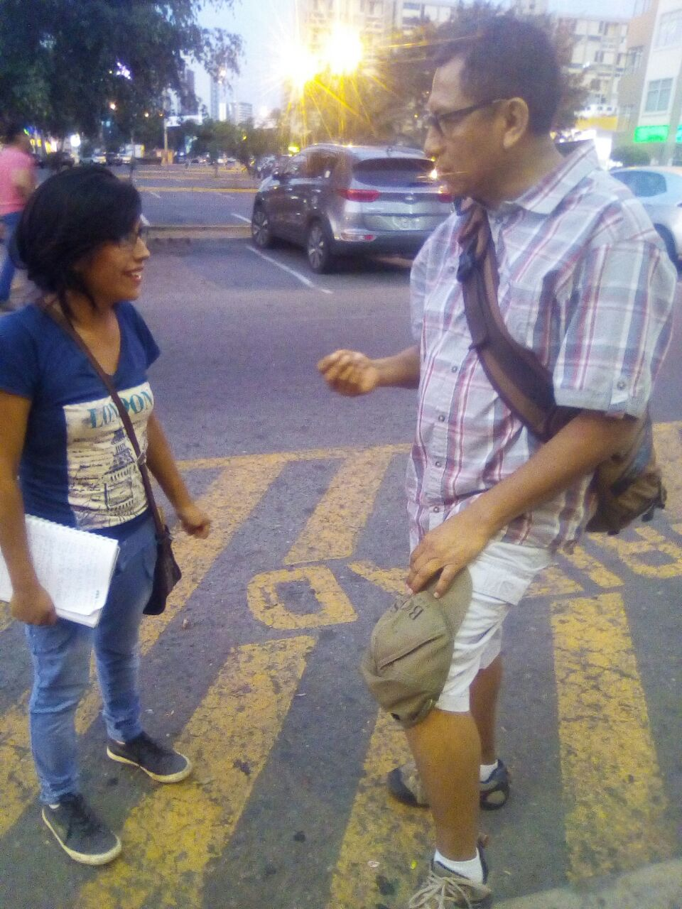
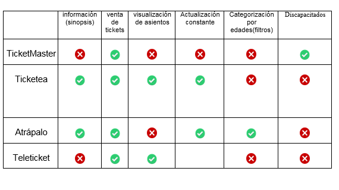
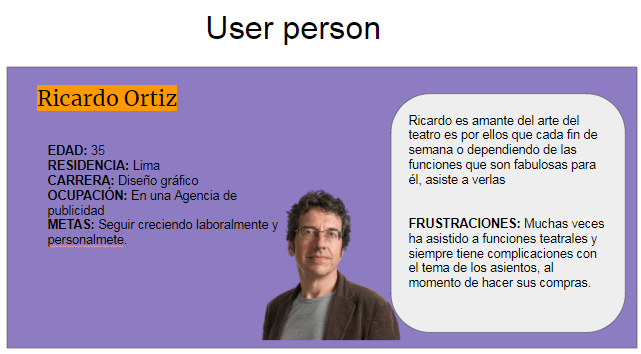
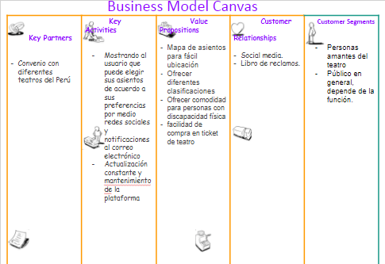
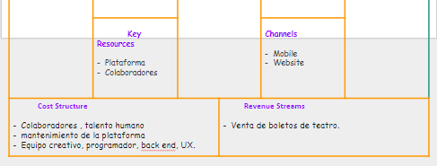

#  JOINNUS

**Joinnus es una plataforma que conecta personas con los mismos intereses permitiendo a usuarios y a empresas la creación, difusión, gestión y cobro de eventos en Lima y en todo el país de manera sencilla, eficaz y gratuita.**

###### Integrantes:
- Angelica Villalobos
- Flora Huerta

#### OBJETIVO :
Joinnus nos ha encargado la tarea de  mejorar la experiencia de los usuarios  al momento  de realizar  la compra de tickets de   teatro. Ofreciéndoles las facilidades para poder realizar  todo el proceso de  compra de tickets de manera online.

### Público Objetivo :
- Amantes del teatro.
- Seguidores del arte.
- Público en general.

# DESCUBRIMIENTO E INVESTIGACIÓN

## RESEARCH

#### * **ENTREVISTAS**
Para  poder indagar más a profundidad las necesidades de  los usuarios y sus requerimientos, salimos a entrevistar al teatro Peruano-japonés a  personas que frecuentan los teatros, y así lograr entender cuáles son su interés, problemática, motivos, expectativas, etc.

#### * **BENCHMARKING**

Realizamos un estudio de Benchmarking , Para situarnos en el contexto respecto a los competidores  del mercado, permitiéndonos saber si estamos haciendo bien las cosas o bien tenemos margen para mejorarlas y detectar oportunidades, amenazas así como debilidades y fortalezas .
El estudio lo realizamos a plataformas como :

- Atrápalo
- TicketMaster
- Ticketea
- Teleticket

Luego de recabar información  realizamos  un brainstorming , para lograr organizar  nuestras ideas realizamos  un  diagrama  de afinidad ,  donde agrupamos  los datos  más frecuentes  .
Asi detectar los requerimientos  más frecuentes  en los usuarios .

#### USER PERSONA
Definimos a nuestro usuario principal.

#### BUSINESS MODEL CANVAS

